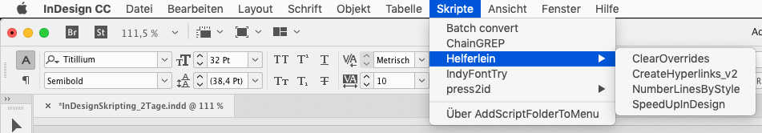
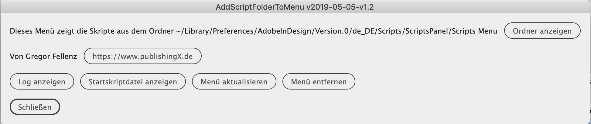

# addScriptFolderToMenu
Add  scripts from a folder to the InDesign menu!

No english documentation yet, sorry. Try the german one:

# Skripte ins Menü einbinden

Mit dem Skript ***addScriptFolderToMenu*** kann das InDesign-Menü mit eigenen Skripten erweitert werden. 



## Problem
Die Verwaltung und die Benutzung von Skripten hat sich für den Anwender von InDesign seit Version 1 nicht geändert. Dreh und Angelpunkt ist dabei die Skripte-Bedienfeld. 
Die Väter der Idee von ***addScriptFolderToMenu*** stellen fest, dass dieser "versteckte" Zugang einer der Gründe dafür ist, dass die Nutzung der Skripttechnologie vor allem bei Neulingen und technisch wenig versierten Anwendern nur sehr beschränkt erfolgt.

## Ziel
Ziel von ***addScriptFolderToMenu*** ist es den Zugang zu Skripten und damit deren Anwendung in InDesign zu erleichtern. Auch Anfänger und Gelegenheitsnutzer sollen die Skripte prominent sehen und niederschwellig nutzen können.
Seinen besonderen Charme spielt diese Lösung aus, wenn man diese Lösung so konfiguriert, dass mehrere Rechner auf die **gleichen** Skripte zugreift! So ist sicherzustellen, dass alle Teammitglieder immer **alle** Skripte im Zugriff haben und auch immer auf gleichem Stand sind. Eine **Verteilung** von Skripten ist so ein Kinderspiel.

## Vorteile

### In mehreren InDesign-Versionen nutzen
Wenn das Startupscript in mehreren InDesign-Programmversionen installiert ist, kann man das Menü auch in allen nutzen. So ist es möglich in allen InDesign-Versionen ein Set an Skripten zu nutzen.

### Im Team nutzen
Wenn der Ordner für das Menü auf einem Server liegt, ist es möglich, dass das ganze Team mit einem Set an Skripten arbeitet Der Autor dieser Zeilen hat den Ordner in einem G-Drive-Ordner liegen und nutz auf diese Weise das Gleiche Set an Skripten auf mehreren Rechnern.

### Nachteil Tastaturbefehle
Sie können den Skripten für das Menü nur dann Tastaturbefehle zuweisen, wenn der Ordner im Skripte-Bedienfeld sichtbar ist. Dann sind die Skripte also sowohl über Menü als auch das Bedienfeld ausführbar.

## Vorabinfo: Was ist ein Startupscript
Ein *Startupskript* liegt in InDesign in einem bestimmten Verzeichnis und wird beim Start des Programms geladen. Damit können verschiedene Szenarien realisiert werden. Unter anderem können, wie in diesem Fall, Menübefehle in InDesign eingefügt werden.

### macOS
`.../Home/Library/Preferences/Adobe InDesign/Version **VERSIONSNUMMER**/de_DE/Scripts/Scripts Panel`
`/Users/<username>/Library/Preferences/Adobe InDesign/Version **VERSIONSNUMMER**/de_DE/Scripts`

### Windows

#### Benutzer
`...\Users\<username>\AppData\Roaming\Adobe\InDesign\Version **VERSIONSNUMMER**\de_DE\Scripts`

#### Programm
`...\Program Files\Adobe\Adobe InDesign **VERSIONSNUMMER**\Scripts\startup scripts`

Der schnellste Weg zum richtigen Ordner führt über die Bedienfeld **Skripte** (*Fenster > Hilfsprogramme > Skripte*). Dort gibt es die Ordner *Anwendung* und *Benutzer*. Mit einem Klick per rechte Maustaste kann man diese im Finder/Explorer öffnen. Es öffnet sich der Ordner *Scripts*. Wenn es dort keinen Ordner *startup scripts* gibt, kann man ihn einfach anlegen und Startupskripte hineinlegen

## Bestandteile von ***addScriptFolderToMenu***

### Startupskript
Das Startupskript `addScriptFolderToMenu.jsx` gehört, wie oben beschrieben, in das Verzeichnis *"startup scripts"*. 
Der Ordnerpfad zu den Skripten kann verändert werden. Öffnen Sie das Script in einem geeigneten Texteditor (z.B. VSCode, Notepad++, ...).
Sie finden dort die Zeile `scriptMenuFolderName:`
Fügen sie unter diese Zeile den Pfad zum Ordner ein, der zum Skript gehört. Dies kann der gleiche Ordner sein, es kann aber auch ein beliebiger Ordner auf dem Rechner oder im Netzwerk sein.

*Zum Beispiel*
```javascript
scriptMenuFolderName:
"G:/Meine Ablage/CS Skriptmenu/Scripts_Menu",
```
Wenn Sie den Ordner auf ein Netzwerkverzeichnis legen bedenken Sie, dass sie auf diese Skripte nur zugreifen können, wenn Sie Zugriff auf dieses haben.

### Ordner
In den Ordner, der unter ``scriptMenuFolderName:`` genannt ist, kann man beliebig viele Skripte oder Ordner ablegen. Diese werden in InDesign unter dem Menüpunkt, der unter ``scriptMenuName`` definiert ist, angezeigt.

#### Namenskonventionen
Die Ordner und Skripte werden alphabetisch sortiert. 
* A_ordner
* B_skript
* C_ordner
* D_ordner
* E_ordner

Es ist jedoch zusätzlich möglich die Namen der Ordner und Dateien mit einer zweistelligen Ziffer gefolgt von einem Underline zum umsortieren zu bringen.
* 10_Ordner
* 20_Skript
* 30_Skript
* 35_Skript
* 40_Ordner

#### Skriptnamen Metadaten
Die Namen von Skripten, vor allem, wenn man die kostenlosen aus dem Internet herunterlädt, sind manchmal kryptisch. 
Man kann die Namen, die im Menü erscheinen jedoch manipulieren. Dazu öffnen Sie das Skript und fügen in die erste Zeile des Skriptes ``//SCRIPTMENU:`` ein gefolgt von dem Namen, der im Menü erscheinen soll.

#### Skriptmenü
Der unterste Menüpunkt des Menüs ist ``Über AddScriptFolderToMenu``. Aktiviert man diesen, öffnet sich ein Dialog mit folgenden Buttons:



**[Ordner anzeigen]**
Hier kann der Ordner mit den Skripten, die im Menü angzeigt werden, geöffnet werden. 

**[Log anzeigen]**
Im Ordner von ***addScriptFolderToMenu*** wird ein Ordner "log" erzeugt, der die Log-Datei enthält. Diese Log-Datei hilft im Supportfall. Der Button öffnet diese Log-Datei.

**[Startskriptdatei anzeigen]**
Dieser Button öffnet den Ordner, in dem das Startup-Skript liegt.

**[Menü aktualisieren]**
Wenn der Inhalt des ***addScriptFolderToMenu***-Ordners verändert wird, wirkt sich dies beim nächsten Öffnen von InDesign aus. Um die Änderung ohne Neustart von InDesign wirksam zu machen klickt man auf diesen Button. Dann wird das ***addScriptFolderToMenu***-Menü aktualisiert.

**[Menü entfernen]**
Dies entfernt das Menü aus InDesign


## Zusätzliche Optionen

### Startup Skript
In dieser Zeile im Startupskript kann man den *Namen* des Menüs in InDesign definieren.

*Zum Beispiel*
```javascript
scriptMenuName: localize({ en: "Chris-Scripts", de: "Chris-Skripte" }),
```
In dieser Zeile im Startupskript kann man die Position des *Menüs* in InDesign definieren. 
Bei Position *"table"* erscheint das Menü hinter dem Menüpunkt *"Tabelle"*.

*Zum Beispiel*
```javascript
position: "table", // help
```

### Separator
Um das Menü zu strukturieren, kann man Separatoren einfügen. Das sind dünne graue Linien, wie man sie aus Programmmenüs kennt. 
Diese erzeugt man im ***addScriptFolderToMenu***-Menü über Textdateien, die diesen Dateinamen haben: `separator-----.txt`.
Natürlich kann man auch diese Dateien über vorangestellte Nummern im Menü organisieren.
Also zum Beispiel `80_separator-----.txt`.

#### Credits
* German documentation by Christoph Steffens